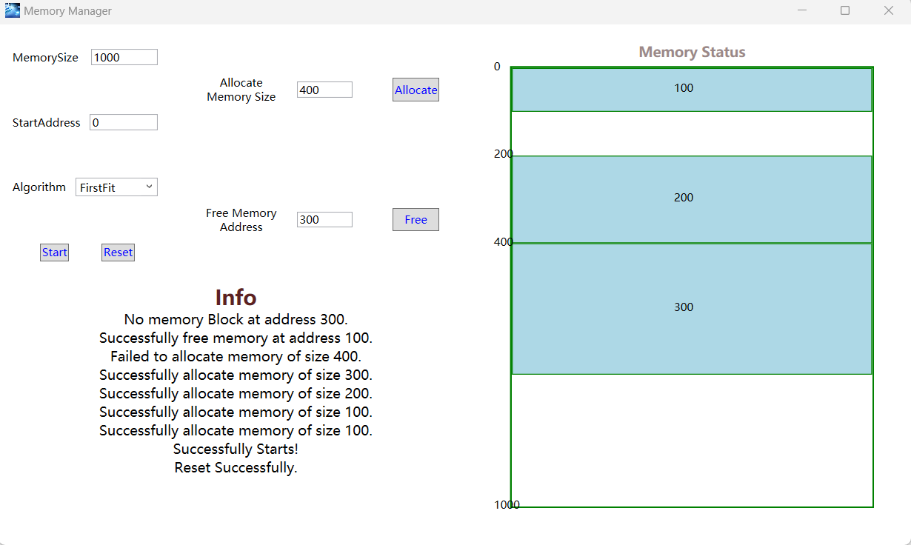
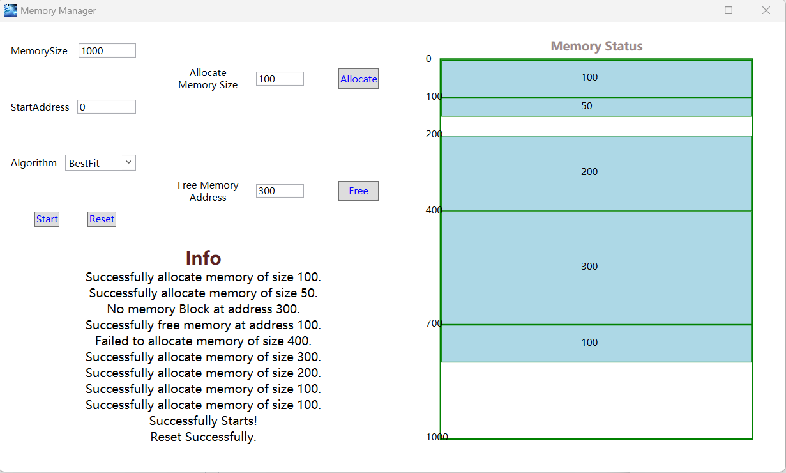

# 存储管理：动态分区存储管理

## 问题描述

基于空闲内存分区链表的存储管理，设计一个动态分区存储管理程序，支持包括首次适配法、下次适配法、最佳适配法和最坏适配法在内的不同分区分配算法。

## 实现要求

1. 维护一个记录已分配内存分区和空闲内存分区的链表；

2. 设计申请、释放函数循环处理用户的请求；

3. 实现首次适配法、下次适配法、最佳适配法和最坏适配法四种分区分配算法；

4. 可视化展示内存使用情况。

## 实验平台

Windows OS；C# 10（.NET 6）

## 实现思路

### 0.基础数据结构

为了方便编程，我使用 C# 中内置的 `List<T>` 数据结构模拟存储管理中链表的操作。`List<T>` 数据结构提供了添加元素的方法 `Add`、删除元素的方法 `DeleteAt`、以及数组访问运算符 `[]`。尽管 `List<T>` 底层并不是用链表实现的，但是不影响用它来模拟链表的操作。这里可以将它视为一个单向链表，封装了增加、删除、访问等操作。

### 1.总体架构

建立内存管理对象 `MemoryManager`，维护其中的空闲内存块链表 `BlankList` 和分配内存块链表 `AllocateList` 。设置内存管理对象中有两个回调函数：分配函数 `Allocate` 和释放函数 `Free`。这两个函数作为参数传入内存管理对象的构造函数中，构成特定适配方法的内存管理对象。内存管理类的定义如下：

~~~C#
public class MemoryManager
{
    public List<MemoryBlock> BlankList { get; set; } = new();
    public List<MemoryBlock> AllocateList { get; set; } = new();
    public int MemorySize { get; init; }
    public int StartAddr { get; init; }
    private Fit fit;
    public bool Allocate(int memorySize) => fit.Allocate(memorySize, BlankList, AllocateList, out _);
    public bool Allocate(int memorySize, out MemoryBlock? retBlock) => fit.Allocate(memorySize, BlankList, AllocateList, out retBlock);
    public bool Free(int startAddr) => fit.Free(startAddr, BlankList, AllocateList, out _);
    public bool Free(int startAddr, out MemoryBlock? retBlock) => fit.Free(startAddr, BlankList, AllocateList, out retBlock);
    public MemoryManager(int memorySize, int startAddr, Fit fit)
    {
        MemorySize = memorySize;
        StartAddr = startAddr;
        this.fit = fit;  
        BlankList.Add(new MemoryBlock(memorySize, startAddr));
    }
}
~~~

### 2.首次适配法

首次适配法，按空闲分区的起始地址排序，从前往后依次查找，找到符合要求的第一个空闲分区，将其分配。

为了避免每次适配时都重新对空闲链表排序，因此在释放分配内存、将释放的内存块加入空闲分区时，应保证空闲分区链表仍然是按起始地址有序的。

同时，每次释放分配内存块并将其加入空闲分区链表时，都应对空闲链表重新检查，将能合并的空闲内存块合并。

首次适配法的分配与释放的代码如下：

~~~C#
public class FirstFit: Fit
{
    public override bool Allocate(int memorySize, List<MemoryBlock> blankList, List<MemoryBlock> allocateList, out MemoryBlock? retBlock)
    {
        for (int i = 0; i < blankList.Count; i++)
        {
            if (blankList[i].MemorySize >= memorySize)
            {
                var memoryBlock = new MemoryBlock(memorySize, blankList[i].StartAddr);
                allocateList.Add(memoryBlock);
                retBlock = memoryBlock;
                blankList[i].MemorySize -= memoryBlock.MemorySize;
                if (blankList[i].MemorySize == 0)
                {
                    blankList.RemoveAt(i);
                }
                else
                {
                    blankList[i].StartAddr += memoryBlock.MemorySize;
                }
                return true;
            }
        }
        retBlock = null;
        return false;
    }

    public override bool Free(int startAddr, List<MemoryBlock> blankList, List<MemoryBlock> allocateList, out MemoryBlock? retBlock)
    {
        retBlock = null;
        var freeIdx = allocateList.FindIndex(x => x.StartAddr == startAddr);
        if (freeIdx == -1)
            return false;
        var freeBlock = allocateList[freeIdx];
        retBlock = freeBlock;
        allocateList.RemoveAt(freeIdx);
        int index = blankList.FindIndex(item => item.StartAddr > freeBlock.StartAddr);
        if (index == -1)
            blankList.Insert(blankList.Count, freeBlock);
        else
            blankList.Insert(index, freeBlock);
        int i = 1;
        while (i < blankList.Count)
        {
            if (blankList[i - 1].StartAddr + blankList[i - 1].MemorySize == blankList[i].StartAddr)
            {
                blankList[i - 1].MemorySize += blankList[i].MemorySize;
                blankList.RemoveAt(i);
                continue;
            }
            i++;
        }
        return true;
    }
}
~~~

### 3.下次适配法

下次适配法，从上次分配的分区后开始查找，找到符合要求的第一个分区。如果查找到最后分区时，下次查找就从头开始。

具体实现上，下次适配法中在每次分配时，都需要记录上次分配的内存块在空闲链表中的位置 `lastAllocIdx`，并维护这个值。当有内存块从分配链表中释放时，根据要释放的内存块的起始地址大小，维护 `lastAllocIdx`。若释放内存的起始地址小于当前空闲链表第 `lastAllocIdx` 位置的内存块起始地址，则说明释放内存块加入链表后，会使 `lastAllocIdx++`。当释放内存块加入空闲链表后，还需要对空闲链表搜索，合并能合并的空闲块。当完全合并了 `lastAllocIdx` 之前了内存块时，需要将 `lastAllocIdx--`。

代码上整体与首次适配法相似，如下

~~~C#
public class NextFit: Fit
{
    private int lastAllocIdx = 0;

    public override bool Allocate(int memorySize, List<MemoryBlock> blankList, List<MemoryBlock> allocateList, out MemoryBlock? retBlock)
    {
        for (int j = 0; j < blankList.Count; j++)
        {
            int i = (j + lastAllocIdx) % blankList.Count;
            if (blankList[i].MemorySize >= memorySize)
            {
                var memoryBlock = new MemoryBlock(memorySize, blankList[i].StartAddr);
                allocateList.Add(memoryBlock);
                retBlock = memoryBlock;
                lastAllocIdx = i;
                blankList[i].MemorySize -= memoryBlock.MemorySize;
                if (blankList[i].MemorySize == 0)
                {
                    blankList.RemoveAt(i);
                }
                else
                {
                    blankList[i].StartAddr += memoryBlock.MemorySize;
                }
                return true;
            }
        }
        retBlock = null;
        return false;
    }

    public override bool Free(int startAddr, List<MemoryBlock> blankList, List<MemoryBlock> allocateList, out MemoryBlock? retBlock)
    {
        retBlock = null;
        var freeIdx = allocateList.FindIndex(x => x.StartAddr == startAddr);
        if (freeIdx == -1)
            return false;
        var freeBlock = allocateList[freeIdx];
        retBlock = freeBlock;
        allocateList.RemoveAt(freeIdx);
        int index = blankList.FindIndex(item => item.StartAddr > freeBlock.StartAddr);
        if (index == -1)
            blankList.Insert(blankList.Count, freeBlock);
        else
            blankList.Insert(index, freeBlock);
        if (index <= lastAllocIdx)  // record the last allcate index of blank list
            lastAllocIdx++;
        int i = 1;
        while (i < blankList.Count)
        {
            if (blankList[i - 1].StartAddr + blankList[i - 1].MemorySize == blankList[i].StartAddr)
            {
                blankList[i - 1].MemorySize += blankList[i].MemorySize;
                blankList.RemoveAt(i);
                if (i <= lastAllocIdx)  // lastAllocIdx-- when merging the blank blocks
                    lastAllocIdx--;
                continue;
            }
            i++;
        }
        return true;
    }
}
~~~

### 4.最佳适配法

每次分配时，找到其大小与要求相差最小的空闲分区进行分配。

由于这里需要按照内存大小进行查找，因此空闲分区链表可以按照空闲内存块大小进行排序。这样在查找时，只需找到第一个比要申请的内存大小大的内存块，就可以进行分配。

在释放内存时，由于空闲分区链表并不是按照内存块起始地址排序的，所以在合并时，要先将空闲分区链表按起始地址排序，这样方便合并相邻的空闲块。合并好后，再将空闲链表按内存块大小排序。

代码如下：

~~~C#
public class BestFit: Fit
{
    public override bool Allocate(int memorySize, List<MemoryBlock> blankList, List<MemoryBlock> allocateList, out MemoryBlock? retBlock)
    {
        retBlock = null;
        int idx = -1;
        for (int i = 0; i < blankList.Count; i++)
        {
            if (blankList[i].MemorySize >= memorySize)
            {
                idx = i;
                break;
            }
        }
        if (idx == -1)
            return false;

        var allocBlock = new MemoryBlock(memorySize, blankList[idx].StartAddr);
        allocateList.Add(allocBlock);
        retBlock = allocBlock;
        blankList[idx].MemorySize -= allocBlock.MemorySize;
        if (blankList[idx].MemorySize == 0)
        {
            blankList.RemoveAt(idx);
        }
        else
        {
            blankList[idx].StartAddr += allocBlock.MemorySize;
            blankList.Sort((x, y) => x.MemorySize.CompareTo(y.MemorySize));
        }
        return true;
    }

    public override bool Free(int startAddr, List<MemoryBlock> blankList, List<MemoryBlock> allocateList, out MemoryBlock? retBlock)
    {
        retBlock = null;
        var freeIdx = allocateList.FindIndex(x => x.StartAddr == startAddr);
        if (freeIdx == -1)
            return false;
        var freeBlock = allocateList[freeIdx];
        retBlock = freeBlock;
        allocateList.RemoveAt(freeIdx);
        blankList.Insert(blankList.Count, freeBlock);
        int i = 1;
        blankList.Sort((x, y) => x.StartAddr.CompareTo(y.StartAddr));
        while (i < blankList.Count)
        {
            if (blankList[i - 1].StartAddr + blankList[i - 1].MemorySize == blankList[i].StartAddr)
            {
                blankList[i - 1].MemorySize += blankList[i].MemorySize;
                blankList.RemoveAt(i);
                continue;
            }
            i++;
        }
        blankList.Sort((x, y) => x.MemorySize.CompareTo(y.MemorySize));
        return true;
    }
}
~~~

### 5.最坏适配法

每次分配时，找到最大的空闲分区进行分配。

最坏适配法的实现几乎与最佳适配法一样。只是在分配时，我们可以直接使用最大的空闲分区（即按内存块大小排序的空闲块链表的最后一个元素）进行分配。如果连最大的空闲分区都无法满足要求，则内存申请失败。

最坏适配法的内存释放函数与最佳适配法一模一样；内存申请函数有改动，如下：

~~~C#
public class WorstFit : Fit
{
    public override bool Allocate(int memorySize, List<MemoryBlock> blankList, List<MemoryBlock> allocateList, out MemoryBlock? retBlock)
    {
        retBlock = null;
        int idx = blankList.Count - 1;
        if (idx == -1 || blankList[idx].MemorySize < memorySize)
            return false;
        var allocBlock = new MemoryBlock(memorySize, blankList[idx].StartAddr);
        allocateList.Add(allocBlock);
        retBlock = allocBlock;
        blankList[idx].MemorySize -= allocBlock.MemorySize;
        if (blankList[idx].MemorySize == 0)
        {
            blankList.RemoveAt(idx);
        }
        else
        {
            blankList[idx].StartAddr += allocBlock.MemorySize;
            blankList.Sort((x, y) => x.MemorySize.CompareTo(y.MemorySize));
        }
        return true;
    }

    public override bool Free(int startAddr, List<MemoryBlock> blankList, List<MemoryBlock> allocateList, out MemoryBlock? retBlock)
}
~~~

## 界面设计

可视化界面如下

1. 首先需要设置整个内存的大小、起始地址、使用适配方法，点击 `Start` 开始模拟。
2. 然后可以自行设计每次要申请的内存大小、要释放的内存块首地址，分别点击 `Allocate` 或 `Free` 完成相应功能。
3. 内存的实际情况将在右侧框图内显示。
4. 所有的记录信息将在左下的 `Info` 标签下显示。
5. 如果想重新开始模拟过程，可以点击左边的 `Reset` 按钮，重置内存设置。

## 实验模拟

总内存大小 1000，起始地址 0，分别使用 `FirstFit`、`NextFit`、`BestFit`、`WorstFit` 进行模拟。

内存的申请与释放顺序如下（注意：其中**申请**的参数为**内存块大小**、**释放**的参数为**内存块起始地址**）：

1. 申请 100
2. 申请 100
3. 申请 200
4. 申请 300
5. 申请 400
6. 释放 100
7. 释放 300
8. 申请 50
9. 申请 100
10. 释放 100
11. 申请 150
12. 释放 400
13. 申请 50
14. 申请 200
15. 申请 100

### 1.首次适配法

上述步骤 1~7，运行结果如下。其中步骤 5 申请内存失败，步骤 7 内存释放失败。

执行 8~9，依次申请 50、100 的内存，根据首次适配算法，应在起始地址为 100 处申请得到 50 的空间，在起始地址为 700 处申请得到 100 的空间。结果如下：

执行 10~12，释放 100、申请 150、释放 400，结果如下：

然后进行 13~15，依次申请 50、200、100。根据首次适配算法，应分别在起始地址为 100、400、600 处申请 50、200、100 的内存。结果如下

可以看到，首次适配算法工作正确，说明算法实现无误。

### 2.下次适配法

上述步骤 1~7，和具体适配方法无关，因此结果与首次适配法中的一样

执行 8~9，依次申请 50、100 的内存，根据下次适配算法，应从起始地址 700 往后申请，结果如下

执行 10~12，释放 100、申请 150、释放 400。由于下次适配算法，申请 150 时从上次申请完毕的 850 地址处开始，结果如下：

然后进行 13~15，依次申请 50、200、100。根据下次适配算法，应从起始地址为 100 处申请 50，然后在起始地址为 400、600 处申请 200、100。结果如下

可以看到，下次适配算法工作正确，说明算法实现无误。

### 3.最佳适配法

上述步骤 1~7，和具体适配方法无关，因此结果与首次适配法中的一样。

执行 8~9，依次申请 50、100 的内存，根据最佳适配算法，应从起始地址 100 往后申请 50，起始地址 700 往后申请 100。结果如下

执行 10~12，释放 100、申请 150、释放 400。结果如下

然后进行 13~15，依次申请 50、200、100。根据最佳适配算法，前两处应分别从起始地址 950、400分配 50、200。第三处既可以从起始地址 100 处分配，也可以从起始地址 600 处分配。结果如下

可以看到，最佳适配算法执行无误，说明算法实现无误。

### 4.最坏适配法

上述步骤 1~7，和具体适配方法无关，因此结果与首次适配法中的一样。

执行 8~9，依次申请 50、100 的内存，根据最坏适配算法，应该在首地址为 700、750 处申请 50、100 内存。结果如下

执行 10~12，释放 100、申请 150、释放 400。结果如下

然后进行 13~15，依次申请 50、200、100。根据最坏适配算法，应该分别在首地址为 400、450、100 处申请到 50、200、100 的内存。结果如下

可以看到，最坏适配算法执行无误，说明算法实现无误。

## 思考题解答

### 1.基于位图和空闲链表的存储管理各有什么优劣？如果使用基于位图的存储管理，有何额外注意事项？

使用位图储存，是将内存划分为小的分配单位，每个分配单位对应位图中的一个位。1 表示占用，0 表示空闲。当一个占用 k 个分配单位的进程调入内存时，操作系统要搜索位图，找到连续的 k 个 0 进行内存分配。

基于链表的存储管理，用链表结构记录并维护已分配内存块、空闲内存块。链表中的每一项或者表示一个进程，或者表示两个进程间的一个空闲分区，至少包含：指示空闲区或进程的标志、内存块起始地址、内存块大小、指下下一个表项的指针。

使用位图的优势在于，由于内存大小有限，所以位图大小固定。当空闲内存块较多时，位图更省空间。但位图的劣势在于，分配内存时，由于需要查找连续多个 0 的块，算法更加复杂；且由于位图方法提前切割了的内存，所以可能会导致有内碎片，造成空间浪费。

是用空闲链表的优势在于，分配内存时只需遍历链表，算法简单，且速度也比位图更快；当空闲内存块较少时，能省空间。但链表的劣势在于，占用空间大小不固定，得动态分配；且当空闲块小而多时，占用空间大。

当使用基于位图的存储管理时，要注意切割内存片的大小。内存片大小过小，位图分配空间时搜索连续 0 的时间将更长；内存片大小过大，可能造成更多的内碎片。

使用位图的存储管理，由于多进程可能同时访问位图，在对内存分配或释放时，应控制对位图的访问是多进程安全的。

## 文件说明

`MemoryGUI/`：GUI 界面代码

`MemoryManage/`：四种适配方法代码

`publish/`：可执行程序及其依赖项

`run.cmd`：启动脚本

构建方式：打开 `MemoryManage/MamoryManage.sln`，以 `MemoryGUI` 项目为启动方式，开始运行

